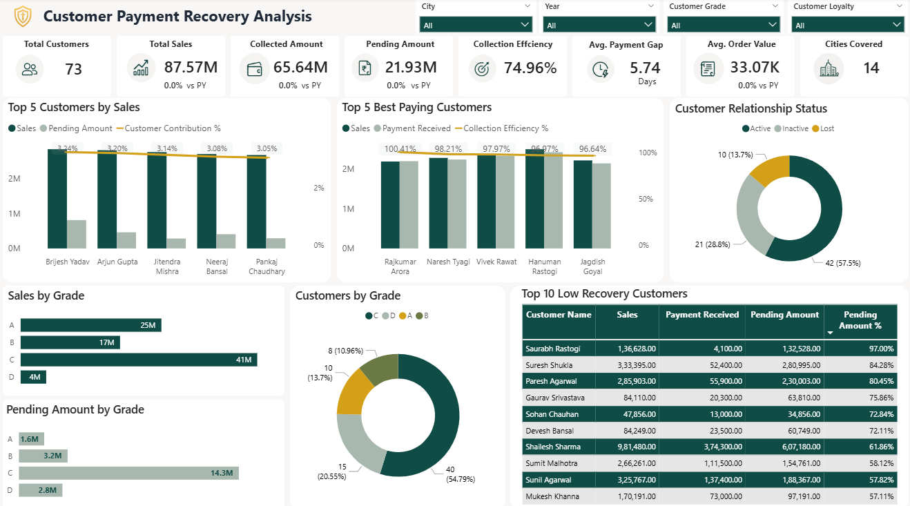
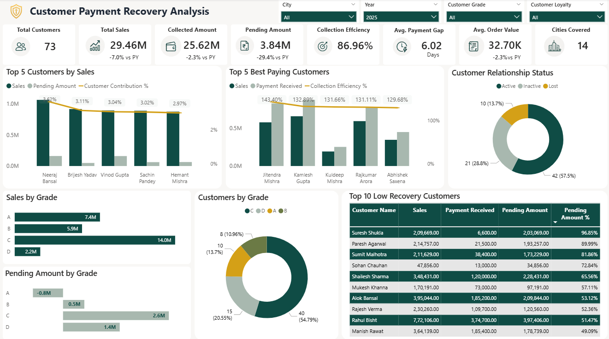
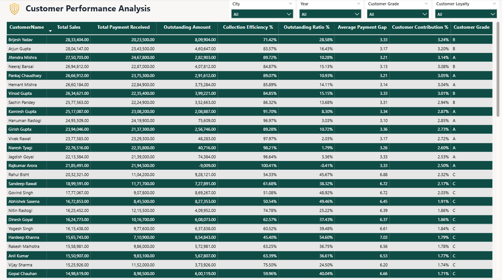
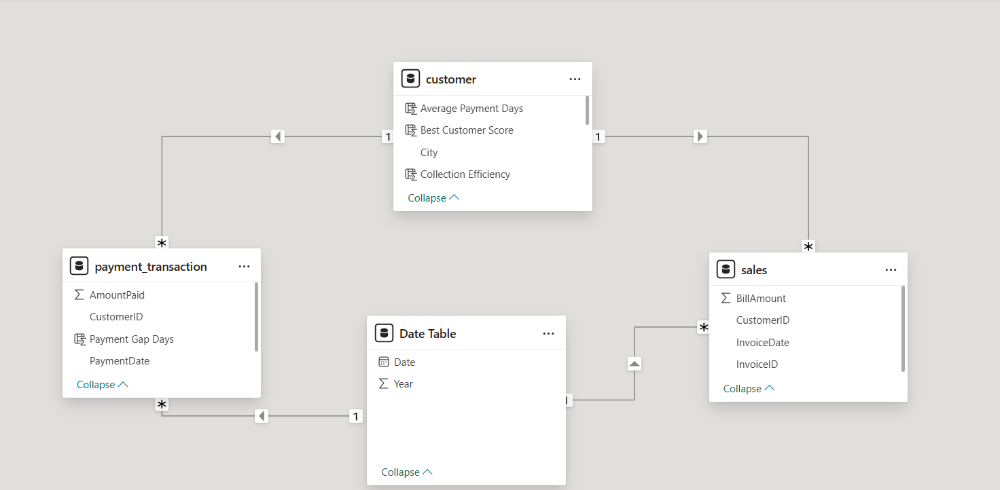

# Transforming My Father's Wholesale Garment Business with Data Analytics

> Built to solve real-world customer credit management challenges in my father's wholesale garment business by improving payment recovery, cash flow, and credit decision-making using Python, SQL, and Power BI.

---

# Dashboard Preview

This dashboard provides a complete view of customer payment behavior, collection efficiency, outstanding amount, customer grading, loyalty, payment recovery, and business performance to support data-driven credit decisions.

---

# Detail View

The Detail View helps analyze individual customer performance, making it easier to identify reliable customers, risky customers, and customers requiring immediate recovery actions.

---

# Data Model & Relationships

The data model was designed using a star schema approach, with optimized relationships among the Customer, Sales, Payment Transaction, and Date tables to ensure accurate filtering and DAX calculations.

---

# Business Background

Unlike most portfolio projects that use public datasets, this project was inspired by a real business problem.

My father owns a **wholesale garment business**, where products are primarily sold on **credit (Udhar)** to retailers and shop owners.

As the business expanded, manually tracking customer payments, outstanding balances, and credit decisions became increasingly difficult. It was challenging to identify reliable customers, risky customers, payment trends, and customers deserving higher credit limits.

To solve these challenges, I built an end-to-end Business Intelligence solution using **Python, SQL Server, and Power BI** that transforms raw business transactions into actionable insights for improving payment recovery, customer management, and credit decision-making.

---

# Problem Statement

The business wanted answers to the following questions:

- Which customers deserve higher credit limits?
- Which customers should have their credit limits reduced?
- Which customers have the best payment habits?
- Which customers have strong business growth potential?
- Which customers are becoming financially risky?
- Which customers require immediate recovery follow-up?
- How has payment recovery improved over time?
- How can payment behavior help grow the business?

This project answers all these business questions using **Python for data cleaning, SQL Server for validation, and Power BI for business intelligence.**

---

# Dataset

The project uses business transaction data collected from the wholesale garment business.

## Tables Used

- `customer`
- `sales`
- `payment_transaction`

---

# Dataset Details

- Customers: **73**
- Sales Invoices: **2,700+**
- Payment Transactions: **11,000+**
- Cities: **14**
- Time Period: **2023 – 2025**

---

# Tools & Technologies Used

## Python

- Exploratory Data Analysis (EDA)
- Data Cleaning
- Data Standardization
- Data Validation
- Data Preparation

### Libraries

- Pandas
- NumPy

---

## SQL Server

- Data Storage
- KPI Validation Queries
- Data Validation

---

## Power BI

- Data Modeling
- DAX Measures
- Interactive Dashboard
- Customer Segmentation
- Executive KPI Design

---

# Data Cleaning Performed

Before loading the data into SQL Server, the raw CSV files were cleaned and validated using **Python (Pandas & NumPy)**.

The following data quality improvements were performed:

- Performed Exploratory Data Analysis (EDA)
- Standardized inconsistent Customer IDs
- Converted mixed date formats into a consistent datetime format
- Removed duplicate and invalid records
- Validated Invoice IDs and Payment IDs
- Verified missing and negative values
- Cleaned Customer, Sales, and Payment Transaction tables
- Loaded the cleaned data into SQL Server for further analysis

This preprocessing ensured accurate KPI calculations, reliable table relationships, and consistent reporting in Power BI.

---

# Data Modeling

Created a star-schema data model using:

- Customer Table
- Sales Table
- Payment Transaction Table
- Date Table

The model was optimized to support efficient filtering, DAX calculations, and business reporting.

---

# What I Built

Developed business KPIs including:

- Total Sales
- Total Payment Received
- Outstanding Amount
- Collection Efficiency
- Outstanding Ratio
- Average Payment Gap
- Customer Grade
- Customer Loyalty
- Best Customer Score
- Year-over-Year Growth

---

# Business Analysis Performed

## Customer Credit Analysis

- Customer Grade
- Best Customer Score
- Credit Decision Support

## Payment Recovery Analysis

- Collection Efficiency
- Outstanding Amount
- Outstanding Ratio
- Payment Gap

## Customer Performance Analysis

- Top Sales Customers
- Best Paying Customers
- High Risk Customers

## Customer Segmentation

- Customer Grade Analysis
- Customer Loyalty Analysis
- Payment Behavior Analysis

## Business Performance

- Sales Trend
- Payment Recovery Trend
- Year-over-Year Growth

---

# Key Business Insights

## 1. Payment Behavior Matters More Than Sales

One of the biggest findings from this project is that **high sales do not always indicate a good customer**. Customers with excellent payment behavior are more valuable because they improve cash flow, reduce outstanding risk, and support sustainable business growth.

---

## 2. Collection Efficiency Improved Every Year

Collection Efficiency improved significantly from **2023 → 2025**, indicating stronger payment recovery, healthier cash flow, and improved working capital management.

---

## 3. Outstanding Amount Reduced Consistently

Outstanding Amount decreased every year, meaning less capital remained blocked in the market and more cash became available for business operations.

---

## 4. Data-Driven Credit Decisions Improved Customer Evaluation

Instead of relying only on experience or sales volume, the business can now evaluate customers using **Collection Efficiency, Outstanding Amount, Payment Gap, Customer Grade, and Best Customer Score**. This enables smarter credit decisions and reduces financial risk.

---

# Business Recommendations

# Business Recommendations

## 1. Implement a Grade-Based Credit Policy

Instead of giving the same credit limit to every customer, assign credit limits based on **Customer Grade**.

- Grade A → Higher Credit Limit
- Grade B → Standard Credit Limit
- Grade C → Limited Credit
- Grade D → Cash Sales

This creates a fair and data-driven credit policy while reducing payment risk.

---

## 2. Reward Customers Based on Payment Performance

Customers with consistently good payment behavior should receive benefits such as:

- Higher Credit Limits
- Festival Discounts
- Priority Order Processing
- Loyalty Rewards

Rewarding reliable customers encourages timely payments and strengthens long-term business relationships.

---

## 3. Launch a Customer Loyalty & Recognition Program

Develop a customer portal where every customer can securely view their:

- Customer Grade
- Payment Performance
- Monthly & Yearly Rank
- Loyalty Status

The portal should also provide personalized recommendations such as:

- *"Clear ₹50,000 more outstanding to reach Grade A."*
- *"Improve Collection Efficiency to enter the Top 10 Customers."*

Recognize the **Top 5 or Top 10 customers** publicly (with their permission) through badges, appreciation certificates, customer photos, and success stories.

This creates healthy competition, encourages timely payments, and improves customer engagement.

---

## 4. Build a Predictive Credit Management System

Use customer payment history, Collection Efficiency, Outstanding Amount, and Payment Gap to proactively identify risky customers before payment defaults occur. This enables the business to take preventive actions rather than reacting after payments become overdue.

---

# Business Impact

This project transformed customer management from experience-based decisions into data-driven decision-making.

Instead of relying only on sales, the business can now evaluate customers using payment behavior, helping to:

- Improve cash flow
- Reduce Outstanding Amount
- Increase Collection Efficiency
- Identify reliable customers
- Reduce payment risk
- Improve credit decisions
- Strengthen customer relationships
- Support sustainable business growth

---

# Future Enhancements

- Customer Web Portal
- Automated WhatsApp Payment Reminders
- Customer Loyalty Program
- Customer Ranking System
- Credit Limit Recommendation Engine
- Payment Default Prediction using Machine Learning

---

# Contact

**Email:** ishantkatiyar68@gmail.com

**LinkedIn:** https://www.linkedin.com/in/ishantkatiyar/
